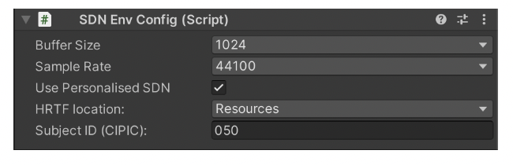
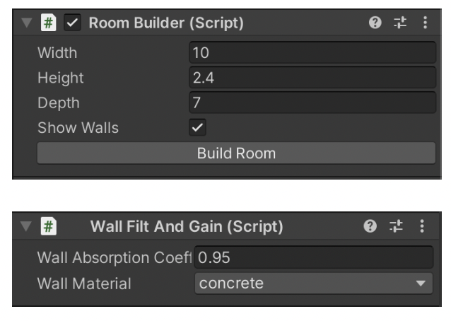
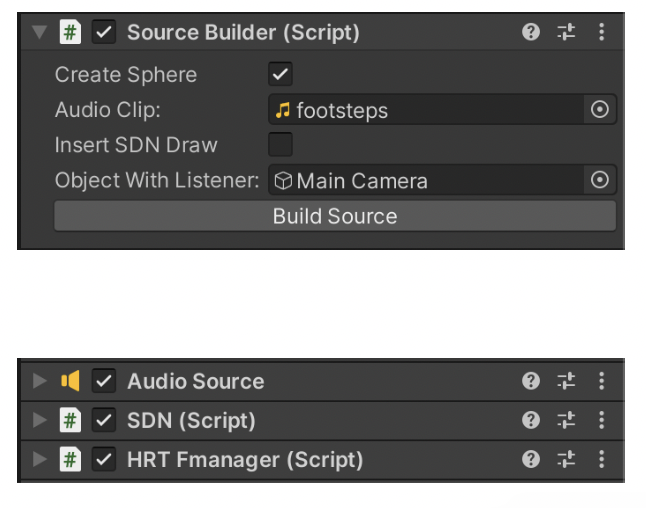
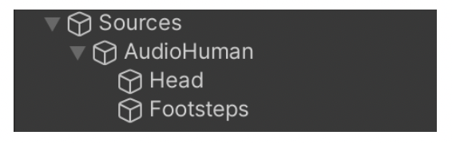
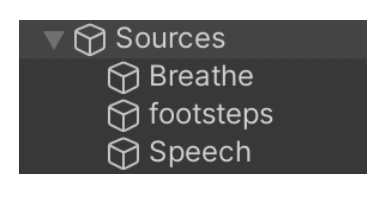

# Binsdn Auralisation Library
A minimal personalization of dynamic binaural synthesis with mixed structural modeling and scattering delay network.

## Library Usage

BinSDN is composed of three main files:

1. **SDN EnvConfig:** (inside MainCamera, next to AudioListener). It contains the startup code for the SDN library. In CIPIC you can specify the preferred HRTF function (more info refer to section §2.1.3). At runtime, it creates *“bounds_DO_NOT_REMOVE”* GameObjects that contains the complete mesh of the room.

2. **RoomBuilder:** creates the Room space (width, height and depth of the room can be specified in meters). Click build to DESTROY the former room and RECREATE it with the new dimensions. With *"Show Wall"* you can decide to show or hide wall meshes. Inside each wall, *“WallFiltAndGain”* script permits to specify Wall Absorption coefficient and Wall Material.

3. **SourceBuilder** (Inside Sources) can be used to create Audio Objects. You must specify the AudioClip (can be changed later), and the Object containing the AudioListener (Main Camera). Click *“Build Source”* to create the GameObject. You can freely move the created object inside the scene and add/remove/change meshes.
Audio Sources will be rendered based on their position inside the 3D space.
At Runtime, a source MUST be inside the room boundaries, not colliding with  walls, floor or ceiling. 

## Included Scenes
To help in development two scenes are included. However, any new scene can be created by including the elements previously described.
### Sample Scene

SampleScene, inside "Scenes" Folder, contains a working example of the library.

SampleScene also contains AudioHuman GameObject, which contains two other  GameObject with samples for testing (can be removed):
- human voice/sphere: height 1.70m with a female voice sample
- footstep/cube: height 5cm with a footstep sample

### Calibration Scene

CalibrationScene, inside "Scenes" Folder, contains three sources that can be used for volume calibration as described in section 2.3

## References
If you use binsdn in your project do not forget to cite this article: 
* M. Geronazzo, J. Y. Tissieres, and S. Serafin, *“A Minimal Personalization of Dynamic Binaural Synthesis with Mixed Structural Modeling and Scattering Delay Networks”* in Proc. IEEE Int. Conf. on Acoust. Speech Signal Process. (ICASSP 2020), Barcelona, Spain, May 2020, pp. 411–415, doi: ICASSP40776.2020.9053873.

